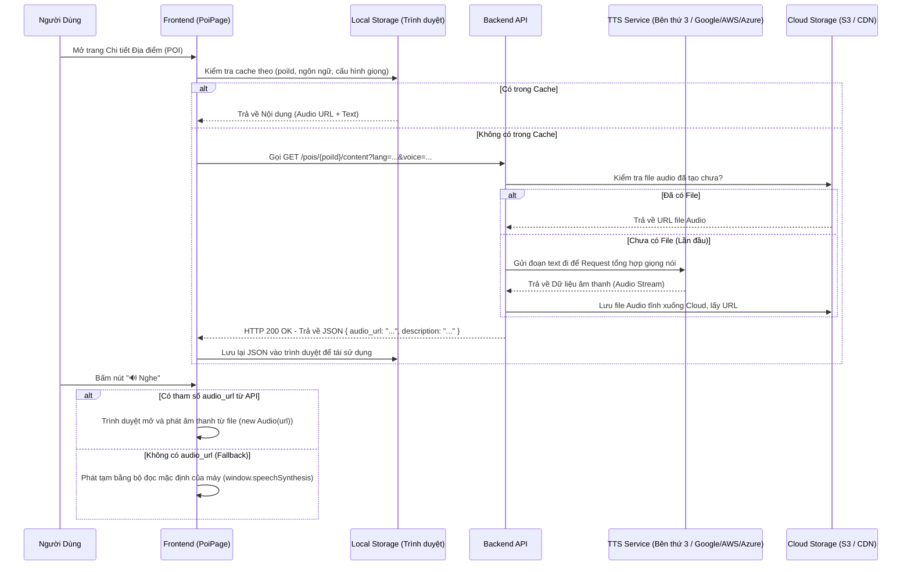

# Luồng Dữ Liệu & Hoạt Động Của Tính Năng Text-to-Speech (TTS)

Dưới đây là phân tích chi tiết về cách Frontend và Backend tương tác với nhau, giải thích cụ thể về luồng hoạt động của hệ thống mô phỏng giọng nói (TTS) và cơ chế lưu trữ dữ liệu.

## 1. Tương tác Frontend và Backend cơ bản

Frontend (React) giao tiếp với Backend qua RESTful API, sử dụng HTTP request thông thường (thông qua hàm chung `apiFetch`). Dữ liệu trao đổi chủ yếu qua định dạng JSON.

- **Khi người dùng vào trang (ví dụ PoiPage):** Frontend sẽ gọi API để lấy thông tin chi tiết của địa điểm (POI), đồng thời lấy nội dung đã dịch sang ngôn ngữ tương ứng (`/pois/{poiId}/content`).
- **Trạng thái Toàn cục (Global State):** Frontend lưu các tùy chọn của người dùng (ngôn ngữ, token đăng nhập) ở Global Store (Zustand: `appStore.ts`), từ đó tự động gắn thông tin cần thiết vào các thành phần UI hoặc Request.

## 2. Luồng hoạt động của tính năng TTS

Tính năng đọc văn bản (TTS) được thiết kế kết hợp giữa **Server-side TTS (AI của Backend)** và **Client-side Fallback (Web Speech API của trình duyệt)**.

### Sơ đồ Luồng Dữ Liệu (Sequence Diagram)

### Chi tiết Các Bước:

1. **Gửi Yêu Cầu (Frontend -> Backend):** 
   Hàm `getPoiContent` (trong `src/api/services/content.ts`) sẽ gọi API xuống Backend theo đường dẫn dạng: 
   `GET /pois/{poiId}/content?lang=vi-VN&voice=Jacek&gender=female&speed=1`
   
2. **Xử Lý Tại Backend:** 
   Backend nhận yêu cầu. Nó sẽ kiểm tra trong CSDL thiết kế xem nội dung dịch của POI này cộng với giọng đọc "Jacek" đã từng được render ra audio hay chưa. 
   - **Nếu có:** Backend chỉ cần trả về link của file Audio url đã có.
   - **Nếu chưa:** Backend sẽ call API qua nhà cung cấp bên thứ ba (Ví dụ AWS Polly, Google Cloud TTS), nhận về file âm thanh tĩnh, sau đó lưu file âm thanh này lên máy chủ tĩnh (Cloud Storage S3) và cấp cho nó một đường link (URL tĩnh). Backend lưu link đó vào CSDL, rồi trả về cho Frontend.

3. **Phát Âm Thanh trên UI:** 
   Dữ liệu JSON trả về cho Frontend sẽ có thuộc tính `audio_url`. Trong giao diện (`PoiPage.tsx`), khi user bấm nút "Nghe", một thẻ HTML5 `new Audio(audio_url)` sẽ được khởi tạo và chạy. Playback rate (tốc độ đọc) có thể được chỉnh trực tiếp trên Audio Element này.

4. **Client-side Fallback (Cơ chế dự phòng cực tốt):** 
   Trong trường hợp Backend bị lỗi, hoặc địa điểm chưa kịp có `audioUrl`, hệ thống ở Frontend có viết code tự động hạ cấp xuống sử dụng **Web Speech API** của trình duyệt (`window.speechSynthesis.speak()`). Đây là API tích hợp sẵn trên các máy tính/điện thoại, có thể tự động đọc chữ thành tiếng mà không cần mạng.

## 3. Cơ Chế Lưu Trữ & Kỹ Thuật Tối Ưu (Caching)

Dữ liệu được lưu trữ và tối ưu hóa cực kỳ chặt chẽ chống lạm dụng hệ thống ở nhiều tầng:

### 3.1. LocalStorage Cache (Tại Client)
Frontend lưu kết quả gọi API nội dung vào `localStorage` của trình duyệt.
- **Key lưu trữ:** Cực kỳ chi tiết bao gồm `poi-content:point-id:locale|voice|gender|speed|pitch`
- **Tác dụng:** Lần sau khi user mở đúng ngôn ngữ và cấu hình nói đó cho một POI, Frontend móc dữ liệu `audio_url` ra tức thì không cần đợi Backend. Ứng dụng cũng có nút "Lưu Offline" gọi thẳng hàm cache để cho phép người dùng nạp cache cố tình.

### 3.2. Deduplication Request (In-flight Requests)
Trong `content.ts` sử dụng một map `inFlightRequests`. Nếu React Component render lại nhiều lần và gởi 3 request giống nhau ngay cùng lúc, biến Map này sẽ bắt lại, chặn 2 cái sau. Tất cả đều chờ 1 request thực sự chạy xong thì trả luôn kết quả cho 3, tối ưu băng thông mạng.

### 3.3 Backend Storage
- Các tệp file Audio thực sự được lưu một cách ổn định làm file lưu theo dạng đường dẫn vật lý (Object Storage / CDN tĩnh). 
- Database SQL chỉ lưu một đoạn text đường dẫn `audio_url`, không lưu trữ data Binary của cái file âm thanh, điều này giúp CSDL rất nhẹ nhõm và server trả response rất nhanh.
